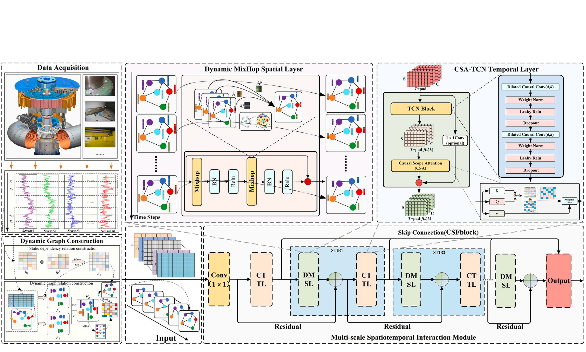
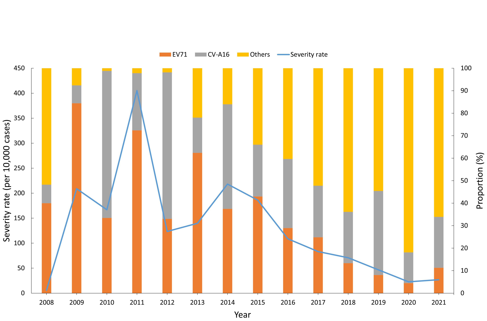
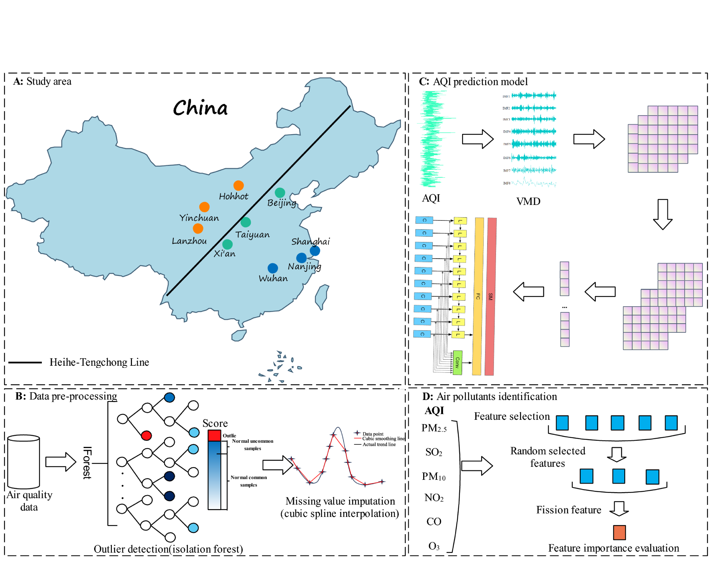
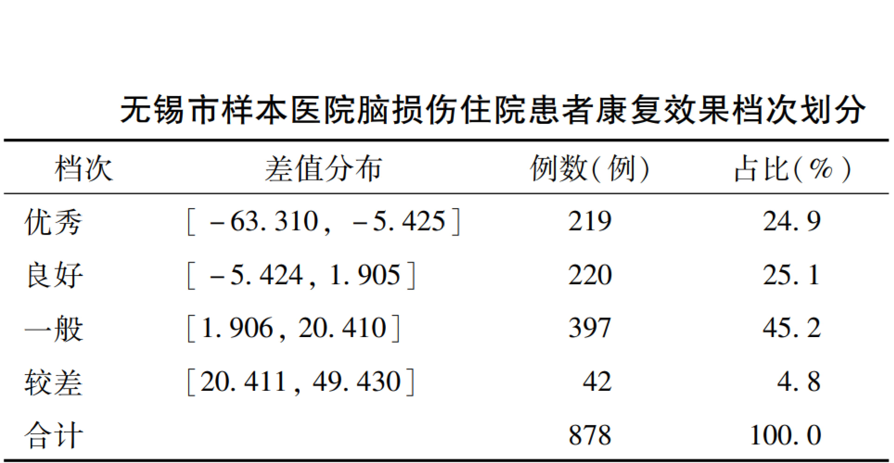
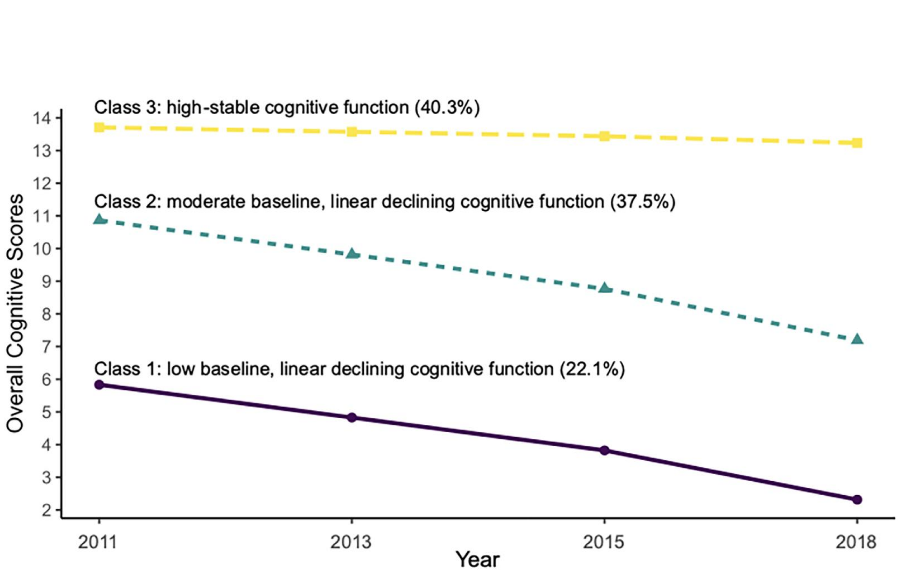
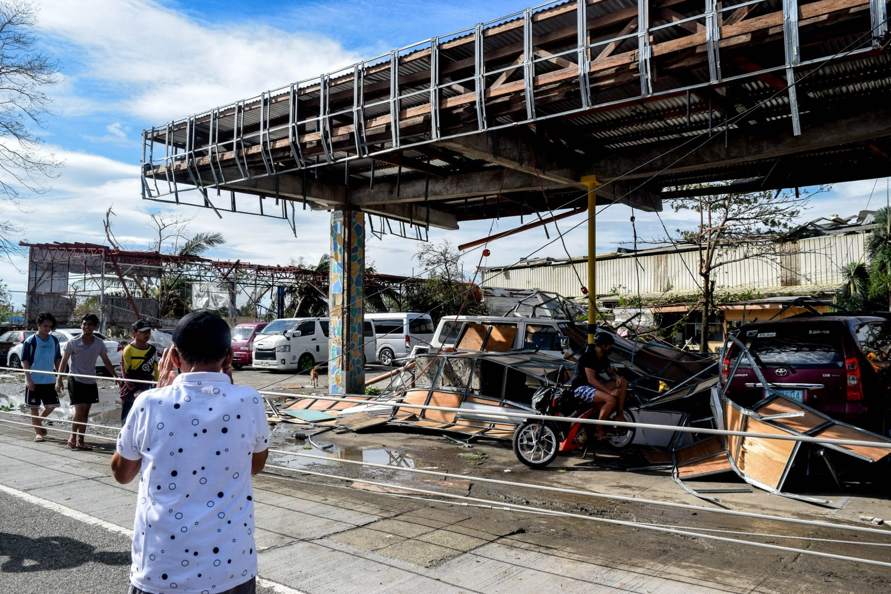
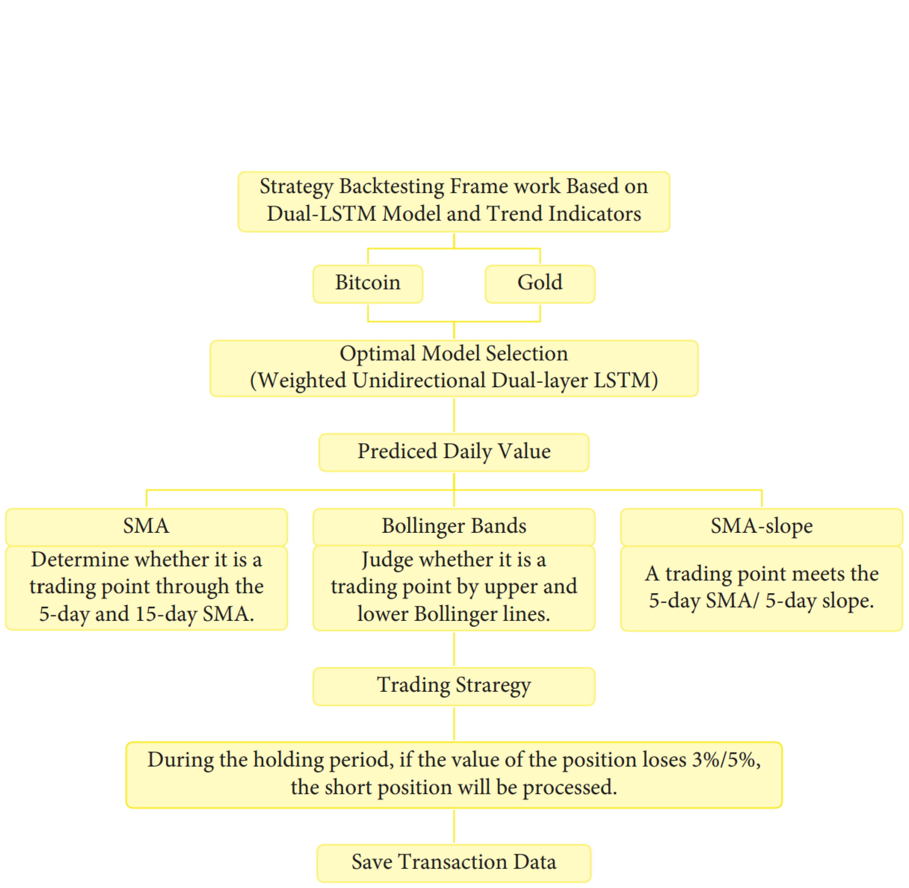

# 📚出版物

Renewable Energy

[**MSTI-GNN: A multi-scale spatiotemporal interactive graph neural network method for precise hydropower unit status prediction**](https://doi.org/10.1016/j.renene.2025.123969) | MSTI-GNN：一种用于精准水电机组状态预测的多尺度时空交互式图神经网络方法 | 2025 
Yi T, Guo J, Meng Y, **Ling Y**, Ke Y, Guo Z
- 本研究开发了一种多尺度时空交互式图神经网络（MSTI-GNN）。该网络采用动态自适应图生成模块，融合了长期稳定依赖关系和短期动态特征，超越了传统的静态图构建方法。

Annals of Emergency Medicine

[**Severity indices of diquat poisoning for triage and prognosis in acute diquat poisoning: a multi-center prospective cohort study**](https://doi.org/10.1016/j.annemergmed.2025.02.022) | [急性敌草快中毒分诊与预后评估的严重程度指数：一项多中心前瞻性队列研究](https://mp.weixin.qq.com/s/MCAnXHPvmi6ER1acYU7GFA) | 2025 
**Ling Y#**, Mao Z#, Liu W#, Zhou C, Li J, Jiang L, Li M, Zhao H, Nie S, Wu C, Chen J, Bai G, Ren G, Xu J, Chen F, Zhang J, Sun H
- 本研究开发并验证了敌草快中毒严重程度指数（severity indices for diquat poisoning，SIDPs），旨在帮助急诊科医生结合患者的临床数据评估其死亡风险，以便进行分诊和预后判断。
- 这项多中心前瞻性队列研究一共纳入了204名敌草快中毒患者。本研究采用Burota算法和逐步Cox回归进行特征选择，并通过Cox比例风险模型构建了分别用于分诊（severity indices for diquat poisoning for triage，SIDP-T）和预后评估（severity indices for diquat poisoningfor prognosis，SIDP-P）的严重程度指数。
- 本研究为构建的中毒严重程度指数开发了一个[线上交互平台](https://severityindexofdiquatpoisoning.streamlit.app/)，以便急诊科医生在临床诊疗中直接应用严重程度指数。

JMIR Public Health and Surveillance

[**Influence of the Enterovirus 71 Vaccine and the COVID-19 Pandemic on Hand, Foot, and Mouth Disease in China Based on Counterfactual Models: Observational Study**](https://publichealth.jmir.org/2024/1/e63146) | 肠道病毒71型疫苗和新冠疫情对中国手足口病流行的影响：一项基于反事实模型的观察性研究 | 2024 
Nie J, Huang T, Sun Y, Peng Z, Yang H, Zheng D, Guo F, Xu M, **Ling Y**, Zhao W, Yan X, Shui T
- 本研究旨在评估中国云南省手足口病的长期流行病学趋势，并采用反事实自回归积分移动平均（autoregressive integrated moving average，ARIMA）模型分析肠道病毒71型疫苗接种项目和新冠疫情所产生的影响。

BMC Pulmonary Medicine

[**Impact of an enhanced recovery after surgery program integrating cardiopulmonary rehabilitation on post-operative prognosis of patients treated with CABG: protocol of the ERAS-CaRe randomized controlled trial**](https://doi.org/10.1186/s12890-024-03286-1) | 整合心肺康复的加速康复外科方案对冠状动脉旁路移植术患者术后预后的影响：ERAS-CaRe随机对照试验方案 | 2024 
Yang Q#, Wang L#, Zhang X#, Lu P#, Pan D#, Li S#, **Ling Y#**, Zhi X#, Xia L, Zhu Y, Chen Y, Liu C, Jin W, Reinhardt JD, Wang X, Zheng Y
- 该研究方案设计了一项实用性、随机对照、平行四臂的临床试验，旨在评估在加速康复外科（enhanced recovery after surgery，ERAS）流程中整合心肺康复的模式是否优于仅采用ERAS的方案，并进一步探讨在ERAS流程中不同时机（术前、术后、围手术期）进行心肺康复对冠状动脉旁路移植术后心肺并发症的影响。

Scientific Reports

[**Optimized air quality management based on air quality index prediction and air pollutants identification in representative cities in China**](https://doi.org/10.1038/s41598-024-68972-w) | 基于空气质量指数预测与污染物识别的中国代表性城市空气质量优化管理 | 2024 
Guo Z, Jing X, **Ling Y***, Yang Y, Jing N, Yuan R, Liu Y
- 本研究开发了VMD-CSA-CNN-LSTM模型，以预测空气质量指数。该模型融合了变分模态分解（variational mode decomposition，VMD）、变色龙群算法（chameleon swarm algorithm ，CSA）、卷积神经网络 (convolutional neural networks，CNN）和长短期记忆（long short-term memory，LSTM）网络。
- 本研究使用来自中国九个具有代表性的城市（呼和浩特、银川、兰州、北京、太原、西安、上海、南京、武汉）的数据对所开发的模型进行了验证，并利用随机森林算法识别了每个城市的主要空气污染物。

中国卫生政策研究

[**以价值为导向的住院康复服务价值调节因子构建研究**](http://journal.healthpolicy.cn/html/20240307.htm) | 2024 
王萱萱, 励建安, 魏小雷, 刘守国, 李嘉慧, 李阳, 凌阅微, 路定珍, 陈家应
- 本研究开发了一个住院康复服务的价值调节因子，旨在实现对康复治疗效果的可比性评估，从而为中国医疗保险体系下建立价值付费机制提供可行思路。

PLOS ONE

[**Trajectories of cognitive decline among people over 45 years old with diabetes in China: a nationally representative longitudinal study (2011~2018)**](https://doi.org/10.1371/journal.pone.0299316) | 中国45岁及以上糖尿病患者认知功能轨迹：一项全国代表性纵向研究 (2011~2018) | 2024 
Chen S#, **Ling Y#**, Zhou F, Qiao X, Reinhardt JD
- 本研究利用全国代表性的中国健康与养老追踪调查（China Health and Retirement Longitudinal Study，CHARLS）数据识别了中国45岁及以上糖尿病患者的三种认知功能轨迹。
- 本研究采用增长混合模型来识别不同的认知轨迹，并应用加权多项逻辑回归分析了相关的基线风险因素。

APN Science Bulletin

[**Developing capacity for post-typhoon disaster waste management in Lautoka, Fiji, and Makati, Philippines**](https://www.apn-gcr.org/bulletin/article/developing-capacity-for-post-typhoon-disaster-waste-management-in-lautoka-fiji-and-makati-philippines/) | 斐济劳托卡与菲律宾马卡蒂的台风灾后废弃物管理能力建设 | 2023 
Fernandez G, Asari M, Uy N, Veitata S, Fayazi M, **Ling Y**, Xu Q, Wang H, Ramos LV, and Singh S
- 本项目旨在提升斐济劳托卡市与菲律宾马卡蒂市进行有效台风灾后废弃物管理的能力。
- 在国际学术合作的支持下，本项目开展了培训需求评估，开发并提供了六个专项培训模块，促进了利益相关方研讨会，并指导了灾害废弃物管理应急预案的参与式制定。

Computational Intelligence and Neuroscience

[**Portfolio Optimization Model for Gold and Bitcoin Based on Weighted Unidirectional Dual-Layer LSTM Model and SMA-Slope Strategy**](https://www.hindawi.com/journals/cin/2022/1869897) | 基于加权单向双层LSTM模型与SMA-斜率策略的黄金与比特币投资组合优化模型 | 2022 
Xue Q, **Ling Y**, Tian B
- 本研究采用加权单向双层长短期记忆（long short-term memory，LSTM）网络模型预测每日价格，并结合经粒子群算法优化的简单移动平均线-斜率策略。
- 该策略利用*k*-斜率指标来增强买卖信号，并通过为期五年的交易模拟验证了其有效性。

## 在投论文

- **Ling Y#**, Mao Z#, Li J#, Zhang H, Zhou C, Liu W, Zhou Y, Jiang L, Li M, Zhao H, Nie S, Xu J, Geng P, Xu C, Huang J, Chen F, Zhang J, Sun H. Leveraging plasma concentration levels to optimize extracorporeal treatment in acute diquat poisoning: a multi-center retrospective cohort study. 利用血药浓度优化急性敌草快中毒的体外净化治疗：一项多中心回顾性队列研究. (Under Review at *Clinical Toxicology*)
- **Ling Y#**, Shahmon E#, Brandeau ML, Yamin D. Improving imputation of missing data in time series through multi-scale modeling of periodicity: a smartwatch application. 通过多尺度周期性建模改进时间序列中的缺失数据插补：以智能手表应用为例. (Submitted to *Information Fusion*)
- **Ling Y**, Hui J, Fernandez G, Xu Q, Wang H. Content analysis of policies on disaster waste management in Sichuan, China: trends and ways forward. 中国四川省灾害废弃物管理政策的内容分析：趋势与展望. (In Preparation for *Progress in Disaster Science*)

（#：共同一作；*：通讯作者）