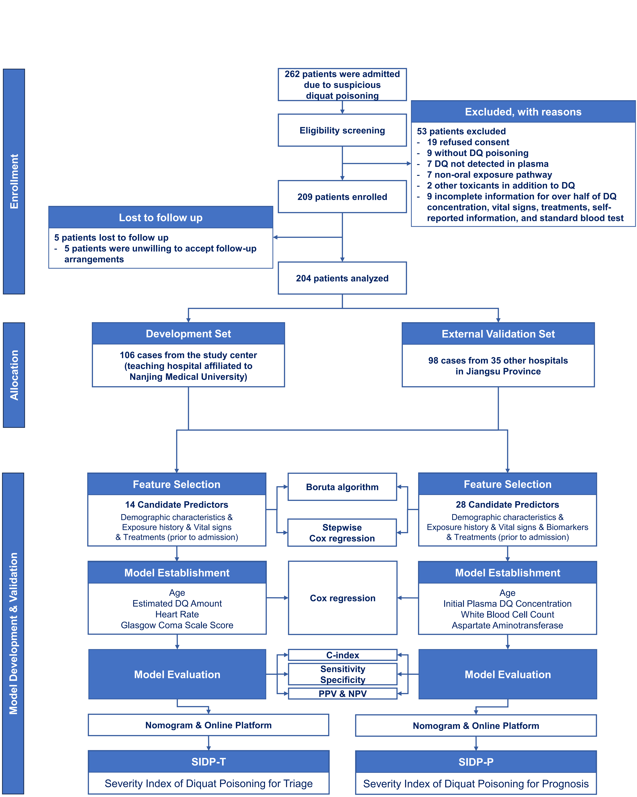

# 📚出版物

Annals of Emergency Medicine

[**Severity indices of diquat poisoning for triage and prognosis in acute diquat poisoning: a multi-center prospective cohort study**](https://doi.org/10.1016/j.annemergmed.2025.02.022) | 急性敌草快中毒分诊与预后评估的严重程度指数：一项多中心前瞻性队列研究 | 2025 
**Ling Y#**, Mao Z#, Liu W#, Zhou C, Li J, Jiang L, Li M, Zhao H, Nie S, Wu C, Chen J, Bai G, Ren G, Xu J, Chen F, Zhang J, Sun H
- 本研究开发并验证了敌草快中毒严重程度指数（severity indices for diquat poisoning，SIDPs），旨在帮助急诊医生根据患者自述的临床数据及实验室生物标志物，评估死亡风险，以进行分诊和28天预后判断。
- 这项多中心队列研究共纳入204名患者。研究将通过Burota算法和逐步Cox回归筛选出的预测因子纳入Cox比例风险模型，从而构建了分别用于分诊（SIDP-T）和预后评估（SIDP-P）的严重程度指数。
- 本研究开发了一个[**线上交互平台**](https://severityindexofdiquatpoisoning.streamlit.app/)，以便急诊医生在临床诊疗中直接应用该严重程度指数。

JMIR Public Health and Surveillance

[**Influence of the Enterovirus 71 Vaccine and the COVID-19 Pandemic on Hand, Foot, and Mouth Disease in China Based on Counterfactual Models: Observational Study**](https://publichealth.jmir.org/2024/1/e63146) | 肠道病毒71型疫苗和新冠疫情对中国手足口病流行的影响：一项基于反事实模型的观察性研究 | 2024 
Nie J, Huang T, Sun Y, Peng Z, Yang H, Zheng D, Guo F, Xu M, **Ling Y**, Zhao W, Yan X, Shui T
- 本研究旨在评估中国云南省手足口病的长期流行病学趋势，并采用反事实自回归积分移动平均 (autoregressive integrated moving average，ARIMA) 模型，分析了肠道病毒71型疫苗接种项目和新冠疫情所带来的影响。

BMC Pulmonary Medicine

[**Impact of an enhanced recovery after surgery program integrating cardiopulmonary rehabilitation on post-operative prognosis of patients treated with CABG: protocol of the ERAS-CaRe randomized controlled trial**](https://doi.org/10.1186/s12890-024-03286-1) | 整合心肺康复的加速康复外科方案对冠状动脉旁路移植术患者术后预后的影响：ERAS-CaRe随机对照试验方案》 | 2024 
Yang Q#, Wang L#, Zhang X#, Lu P#, Pan D#, Li S##, **Ling Y#**, Zhi X#, Xia L, Zhu Y, Chen Y, Liu C, Jin W, Reinhardt JD, Wang X, Zheng Y
- 该研究方案设计了一项实用性、随机对照、平行四臂的临床试验，旨在评估在加速康复外科 (enhanced recovery after surgery，ERAS) 流程中整合心肺康复是否优于单纯ERAS方案，并探讨在ERAS流程中不同时机（术前、术后、围手术期）进行心肺康复对冠状动脉旁路移植术后心肺并发症的影响。

Scientific Reports

[**Optimized air quality management based on air quality index prediction and air pollutants identification in representative cities in China**](https://doi.org/10.1038/s41598-024-68972-w) | 基于空气质量指数预测与污染物识别的中国代表性城市空气质量优化管理 |2024 
Guo Z, Jing X, **Ling Y***, Yang Y, Jing N, Yuan R, Liu Y
- 本研究利用来自中国九个代表性城市的数据，构建了一个VMD-CSA-CNN-LSTM模型，该模型融合了变分模态分解 (variational mode decomposition，VMD)、变色龙群算法 (chameleon swarm algorithm ，CSA)、卷积神经网络 (convolutional neural networks，CNN) 和长短期记忆 (long short-term memory，LSTM) 网络。此外，本研究还采用随机森林算法识别了主要空气污染物。

中国卫生政策研究

[**以价值为导向的住院康复服务价值调节因子构建研究**](http://journal.healthpolicy.cn/html/20240307.htm) | 2024 
王萱萱, 励建安, 魏小雷, 刘守国, 李嘉慧, 李阳, 凌阅微, 路定珍, 陈家应
- 本研究开发了一个住院康复服务的价值调节因子，旨在实现对康复治疗效果的可比性评估，从而为中国医疗保险体系下建立价值付费机制提供可行思路。

PLOS ONE

[**Trajectories of cognitive decline among people over 45 years old with diabetes in China: a nationally representative longitudinal study (2011~2018)**](https://doi.org/10.1371/journal.pone.0299316) | 2024 
Chen S#, **Ling Y#**, Zhou F, Qiao X, Reinhardt JD
- This study found three cognitive trajectories among Chinese adults aged 45 and older with diabetes using data from the nationally representative China Health and Retirement Longitudinal Study (CHARLS). 
- We employed a growth mixture model to identify cognitive trajectories, and examined baseline risk factors using weighted multinomial logistic regression.

APN Science Bulletin

[**Developing capacity for post-typhoon disaster waste management in Lautoka, Fiji, and Makati, Philippines**](https://www.apn-gcr.org/bulletin/article/developing-capacity-for-post-typhoon-disaster-waste-management-in-lautoka-fiji-and-makati-philippines/) | 2023 
Fernandez G, Asari M, Uy N, Veitata S, Fayazi M, **Ling Y**, Xu Q, Wang H, Ramos LV, and Singh S
- This work aimed to enhance the capacity of Lautoka, Fiji, and Makati, Philippines, for effective post-typhoon disaster waste management.
- The project conducted training needs assessments, developed and delivered six targeted training modules, facilitated stakeholder workshops, and guided the participatory creation of disaster waste management contingency plans, supported by international academic collaboration.

Computational Intelligence and Neuroscience

[**Portfolio Optimization Model for Gold and Bitcoin Based on Weighted Unidirectional Dual-Layer LSTM Model and SMA-Slope Strategy**](https://www.hindawi.com/journals/cin/2022/1869897) | 2022 
Xue Q, **Ling Y**, Tian B
- This study integrates a weighted unidirectional dual-layer long short-term memory (LSTM) model for daily price prediction with a particle swarm-optimized SMA-slope strategy, which enhances buy/sell signals using *k*-slope indicators, and evaluates its effectiveness through five-year trading simulations.

## Working Papers

- **Ling Y#**, Mao Z#, Li J#, Zhang H, Zhou C, Liu W, Zhou Y, Jiang L, Li M, Zhao H, Nie S, Xu J, Geng P, Xu C, Huang J, Chen F, Zhang J, Sun H. Leveraging plasma concentration levels to optimize extracorporeal treatment in acute diquat poisoning: a multi-center retrospective cohort study. (Under Review at *Clinical Toxicology*)
- **Ling Y#**, Shahmon E#, Brandeau ML, Yamin D. Improving imputation of missing data in time series through multi-scale modeling of periodicity: a smartwatch application. (Submitted to *Information Fusion*)
- **Ling Y**, Hui J, Fernandez G, Xu Q, Wang H. Content analysis of policies on disaster waste management in Sichuan, China: trends and ways forward. (In Preparation for *Progress in Disaster Science*)

（#：共同一作；*：通讯作者）